# Charlie Budget

A personal budgeting and investment tracking web app

## Local Dev

```bash
# 1. Start local Supabase (Docker must be running)
npx supabase start

# 2. Set up env
cp web/.env.local.example web/.env.local
# Fill in the keys printed by `supabase start`

# 3. Reset DB (applies all migrations + seeds test data)
npx supabase db reset

# 4. Run the app
cd web && npm run dev
```

**Test login:** `test@charlie.dev` / `password123`

See [docs/supabase-setup.md](docs/supabase-setup.md) for Plaid sandbox setup and production deployment.

---

## Tech Stack

| Layer | Technology | Purpose |
|-------|-----------|---------|
| Frontend | [Next.js](https://nextjs.org/) (App Router) | UI, server components, route handlers |
| UI Components | [shadcn/ui](https://ui.shadcn.com/) + [Tailwind CSS v4](https://tailwindcss.com/) | Component library + styling |
| Data Fetching | [TanStack Query v5](https://tanstack.com/query) | Client-side fetching, caching, mutations |
| Database & Auth | [Supabase](https://supabase.com/) (PostgreSQL) | Data storage, auth, RLS, edge functions |
| Bank Connectivity | [Plaid](https://plaid.com/) | Account linking, transaction sync |
| Currency Conversion | [Open Exchange Rates](https://openexchangerates.org/) | FX rates |
| Planned: Investments | TBD (e.g. Polygon.io / Alpha Vantage) | Stock quotes, portfolio data |

## Architecture

```
Browser
  └── Next.js (App Router)
        ├── Server Components  → Supabase (direct, server-side)
        └── Route Handlers     → Plaid API / Open Exchange Rates
                                      ↓
                               Supabase (PostgreSQL + RLS)
                                      ↑
                          Supabase Edge Functions
                               ↑ (webhooks)
                             Plaid
```

## Security & Plaid Compliance

| Concern | Approach |
|---------|----------|
| Plaid access tokens | Encrypted at rest with Supabase Vault; **never sent to client** |
| All Plaid API calls | Server-side only via Next.js Route Handlers |
| Plaid webhook verification | Supabase Edge Function validates JWT signature before processing |
| Data isolation | Row Level Security (RLS) on every table — users can only access their own data |
| Secrets | All API keys via environment variables; none exposed to frontend |
| Audit trail | `audit_log` table records sensitive mutations (account link, token refresh, delete) |
| Token refresh | Plaid `ITEM_LOGIN_REQUIRED` webhooks trigger re-auth flow, old tokens invalidated |

## Planned: Investment Features

- Portfolio tracking (holdings, cost basis, unrealized P&L)
- DRIP (Dividend Reinvestment) calculator
- Asset allocation breakdown
- Net worth over time (cash + investments)

## Frontend Design

Site map — see [docs/frontend-flow.md](docs/frontend-flow.md) for detailed user flows per feature.

```mermaid
flowchart TB
    Auth["Auth (own layout)"] --> Login["Login"]
    Auth --> Signup["Sign Up"]
    Auth --> ForgotPW["Forgot Password"]

    App["App Shell"] --> Nav["Left Nav · Bottom Tabs"]
    Nav --> DA["Dashboard"]
    Nav --> AC["Accounts"]
    Nav --> TX["Transactions"]
    Nav --> CA["Categories"]
    Nav --> BU["Budgets"]
    Nav --> RE["Reports"]
    Nav --> IN["Investments"]
    Nav --> SE["Settings"]

    DA --> DA1["Net worth card"]
    DA --> DA2["Income vs spend"]
    DA --> DA3["Top categories"]
    DA --> DA4["Budget progress bars"]
    DA --> DA5["Recent transactions"]

    AC --> AC1["Account list + balances"]
    AC --> AC2["Connect bank (Plaid Link)"]
    AC --> AC3["Manage institution (re-auth · disconnect)"]

    TX --> TX1["List (search + filters)"]
    TX --> TX2["Bulk edit"]
    TX --> TX3["Transaction detail / edit slide-over"]

    CA --> CA1["List + create / edit / archive"]

    BU --> BU1["Month navigator (← · →  · copy prev)"]
    BU --> BU2["Category editor + actuals vs planned"]

    RE --> RE1["Monthly trend + cashflow"]
    RE --> RE2["Category breakdown over time"]

    IN --> IN1["Holdings + P&L"]
    IN --> IN2["Buy / sell history"]
    IN --> IN3["Dividends log"]
    IN --> IN4["Performance chart"]
    IN --> IN5["DRIP calculator"]

    SE --> SE1["Profile"]
    SE --> SE2["Base currency"]
    SE --> SE3["Connected accounts + sync status"]
    SE --> SE4["Export data"]
    SE --> SE5["Delete account"]
```



## DB Schema

See [docs/db-schema.md](docs/db-schema.md)

## Docs

| Doc | What it covers |
|-----|---------------|
| [docs/db-schema.md](docs/db-schema.md) | Full ERD |
| [docs/api-routes.md](docs/api-routes.md) | All API routes — methods, request/response shapes, errors |
| [docs/frontend-flow.md](docs/frontend-flow.md) | User flows per feature |
| [docs/supabase-setup.md](docs/supabase-setup.md) | Local dev, Plaid sandbox, and production deployment |
