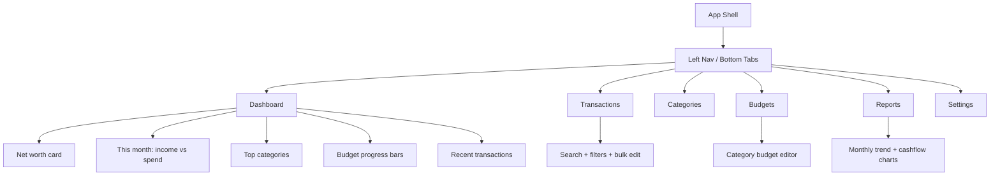

# Charlie Budget

A simple personal budgeting web app

Frontend design

```mermaid
flowchart TB
A["App Shell"] --> B["Left Nav / Bottom Tabs"]
B --> D["Dashboard"]
B --> T["Transactions"]
B --> C["Categories"]
B --> G["Budgets"]
B --> R["Reports"]
B --> S["Settings"]

D --> D1["Net worth card"]
D --> D2["This month: income vs spend"]
D --> D3["Top categories"]
D --> D4["Budget progress bars"]
D --> D5["Recent transactions"]

T --> T1["Search + filters + bulk edit"]
G --> G1["Category budget editor"]
R --> R1["Monthly trend + cashflow charts"]
```