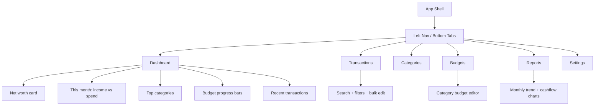

# Charlie Budget

A simple personal budgeting web app

Frontend design

```aiignore
erDiagram
    %% Auth Mirror
    profiles {
        uuid id PK
        text display_name
        timestamptz created_at
    }

    %% Categorization
    categories {
        uuid id PK
        uuid user_id FK
        text name
        text kind
        int sort_order
        boolean archived
        timestamptz created_at
    }

    %% Banking
    accounts {
        uuid id PK
        uuid user_id FK
        text name
        text type
        text source
        text plaid_account_id
        text currency
        numeric current_balance
        timestamptz balance_as_of
        boolean archived
        timestamptz created_at
    }

    %% Ledger
    transactions {
        uuid id PK
        uuid user_id FK
        uuid account_id FK
        uuid category_id FK
        date txn_date
        numeric amount
        text merchant
        text note
        text source
        text plaid_transaction_id
        boolean pending
        timestamptz deleted_at
        timestamptz created_at
    }

    %% Budgeting
    budgets {
        uuid id PK
        uuid user_id FK
        date month
        timestamptz created_at
    }

    budget_lines {
        uuid id PK
        uuid budget_id FK
        uuid category_id FK
        numeric planned_amount
        timestamptz created_at
    }

    %% Relationships
    profiles ||--|| categories : "owns"
    profiles ||--o{ accounts : "owns"
    profiles ||--o{ transactions : "owns"
    profiles ||--o{ budgets : "owns"

    accounts ||--o{ transactions : "contains"
    categories ||--o{ transactions : "classifies"
    
    budgets ||--o{ budget_lines : "contains"
    categories ||--o{ budget_lines : "defines"
```