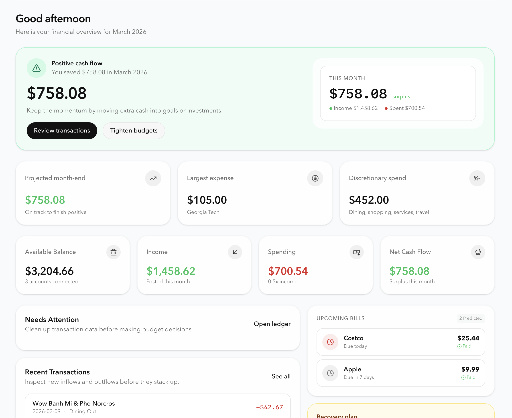
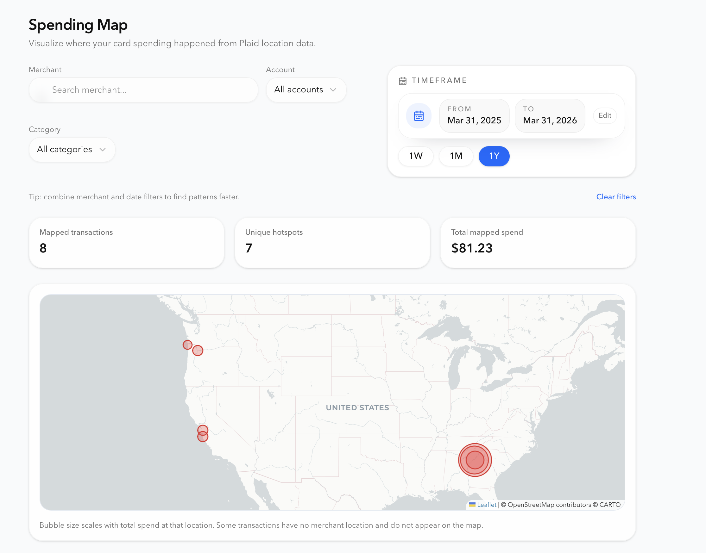

# Charlie Budget

A full-stack personal finance app for budgeting, transaction tracking, account aggregation, and investment planning.

Charlie Budget helps users connect financial accounts, categorize spending, manage monthly budgets, and visualize cashflow with a secure, modern web architecture.

---
## Product Preview

### Financial Overview Dashboard


Core monthly snapshot with cash flow, income vs spend, available balance, upcoming bills, and recent transactions.

### Spending Map (Geo Insights)


Map-based visualization of card spend hotspots using Plaid merchant location metadata, with merchant/account/category/timeframe filters.
## Table of Contents

- [Overview](#overview)
- [Key Features](#key-features)
- [Tech Stack](#tech-stack)
- [Architecture](#architecture)
- [Security & Compliance](#security--compliance)
- [Getting Started](#getting-started)
- [Environment Variables](#environment-variables)
- [Test Credentials](#test-credentials)
- [Project Structure](#project-structure)
- [Product Roadmap](#product-roadmap)
- [Documentation](#documentation)

---

## Overview

Charlie Budget is designed to give users a clear view of their financial health in one place. The app combines:

- **Daily money management** (transactions, categories, budgets)
- **Account connectivity** (bank linking + sync)
- **Insights and reporting** (trends, category analysis, budget progress)
- **Investment tracking foundation** (planned holdings + performance support)

The current implementation includes budgeting and reporting fundamentals, with investments/settings expansion planned.

## Key Features

### Implemented

- **Authentication** via Supabase Auth (email/password flows)
- **Dashboard** with net worth, income vs spend, top categories, and recent transactions
- **Accounts** view with bank connection and account balance aggregation
- **Transactions** list with filtering, search, and editing workflows
- **Categories** CRUD for spending classification
- **Budgets** with monthly planning and actual-vs-planned progress
- **Reports** for trend and category-level analysis
- **Role-safe data access** via Row Level Security (RLS)

### In Progress / Planned

- **Investments module**: holdings, performance, dividends, DRIP calculator
- **Settings enhancements**: profile and data export lifecycle improvements
- **UX polish**: responsive refinements, accessibility hardening, metadata/SEO

## Tech Stack

| Layer | Technology | Purpose |
|-------|-----------|---------|
| Frontend | [Next.js](https://nextjs.org/) (App Router) | UI, server components, route handlers |
| UI Components | [shadcn/ui](https://ui.shadcn.com/) + [Tailwind CSS v4](https://tailwindcss.com/) | Component library + styling |
| Data Fetching | [TanStack Query v5](https://tanstack.com/query) | Client-side caching and mutations |
| Database & Auth | [Supabase](https://supabase.com/) (PostgreSQL) | Data storage, authentication, RLS, edge functions |
| Bank Connectivity | [Plaid](https://plaid.com/) | Account linking and transaction sync |
| Currency Conversion | [Open Exchange Rates](https://openexchangerates.org/) | FX rates for multi-currency support |
| Deployment | [Vercel](https://vercel.com/) | Web deployment/runtime |

## Architecture

```text
Browser
  └── Next.js (App Router)
        ├── Server Components  → Supabase (server-side data access)
        └── Route Handlers     → Plaid API / Open Exchange Rates
                                      ↓
                               Supabase (PostgreSQL + RLS)
                                      ↑
                          Supabase Edge Functions
                               ↑ (webhooks)
                             Plaid
```

### Architectural Notes

- Sensitive financial APIs are invoked **server-side only**.
- User data remains tenant-isolated through Supabase RLS policies.
- Webhook processing is delegated to edge/server boundaries for security and auditability.

## Security & Compliance

| Concern | Approach |
|---------|----------|
| Plaid access tokens | Encrypted at rest (Supabase Vault); never exposed to client |
| Plaid API usage | Executed only in server route handlers |
| Webhook trust | Signature/JWT validation before processing |
| Data isolation | RLS on protected tables to scope access per user |
| Secret management | Environment-variable based secret injection |
| Auditability | `audit_log` tracks sensitive account/token actions |
| Re-auth lifecycle | Handles `ITEM_LOGIN_REQUIRED` and token invalidation flows |

## Getting Started

### Prerequisites

- Node.js (LTS recommended)
- npm
- Docker (required for local Supabase)
- Supabase CLI

### Local Development

```bash
# 1) Start local Supabase services
npx supabase start

# 2) Configure local app env
cp web/.env.local.example web/.env.local
# Fill values using credentials printed by `supabase start`

# 3) Rebuild DB schema + seed data
npx supabase db reset

# 4) Run frontend
cd web
npm install
npm run dev
```

Open: `http://localhost:3000`

## Environment Variables

Set variables in:

- `web/.env.local` for local development
- Vercel project settings for production

At minimum, configure:

- Supabase URL + anon key
- Supabase service role key (server-only)
- Plaid credentials/environment values
- Open Exchange Rates API key

For complete setup details, see [docs/supabase-setup.md](docs/supabase-setup.md).

## Test Credentials

Use seeded test account for local verification:

- **Email:** `test@charlie.dev`
- **Password:** `password123`

## Project Structure

```text
.
├── README.md
├── docs/
│   ├── api-routes.md
│   ├── db-schema.md
│   ├── frontend-flow.md
│   └── supabase-setup.md
├── supabase/
│   ├── migrations/
│   └── functions/
└── web/
    ├── app/
    │   ├── (auth)/
    │   ├── (app)/
    │   └── api/
    ├── components/
    ├── lib/
    └── README.md
```

## Product Roadmap

| Phase | Status | Scope |
|------|--------|-------|
| Foundation | ✅ Complete | Auth, Dashboard, Accounts, Transactions |
| Budgeting & Reports | ✅ Complete | Categories, Budgets, Reporting |
| Investments & Settings | 🔲 Planned | Holdings, dividends, performance, settings expansion |
| Polish | 🔲 Planned | Responsive UX, accessibility, metadata improvements |

## Documentation

| Doc | What it covers |
|-----|---------------|
| [docs/db-schema.md](docs/db-schema.md) | Full database schema and entity model |
| [docs/api-routes.md](docs/api-routes.md) | API routes, request/response contracts, error behavior |
| [docs/frontend-flow.md](docs/frontend-flow.md) | UI routes and user journeys |
| [docs/supabase-setup.md](docs/supabase-setup.md) | Local setup, Plaid sandbox, and deployment guidance |
| [web/README.md](web/README.md) | Frontend-specific setup and conventions |

---

## Recruiter Review (README Quality Check)

### Score: **9.4 / 10**

### What this README does well

- Clearly communicates product scope and business value.
- Explains architecture and security posture in a trustworthy way.
- Gives realistic local setup instructions and practical test access.
- Includes roadmap clarity that helps set engineering expectations.

### Why this is not yet a perfect 10

- Could be stronger with visual proof (screenshots/GIF walkthroughs).
- Could include measurable impact metrics (e.g., sync speed, error rate, perf).
- Could add explicit “Contributing” + “Known Limitations” sections for team onboarding.

### What would make it 10/10

Add:

1. Product screenshots (dashboard, transactions, budgets)
2. A short “Demo flow” section (3–5 steps)
3. Contributing guide + coding standards summary
4. Known limitations and future milestones with rough timelines
