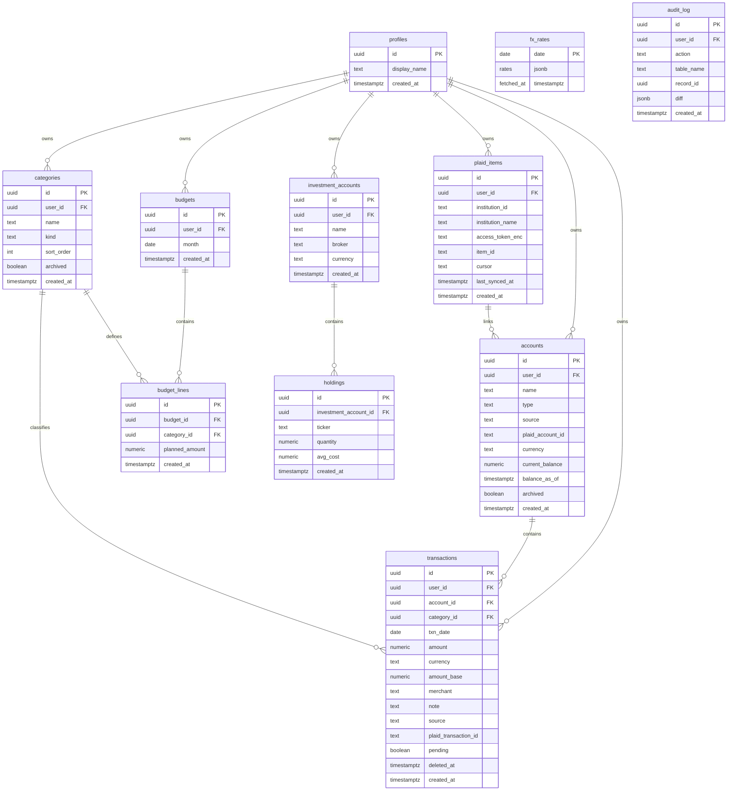

# DB Schema

```mermaid
erDiagram
    %% Auth Mirror
    profiles {
        uuid id PK
        text display_name
        timestamptz created_at
    }

    %% Categorization
    categories {
        uuid id PK
        uuid user_id FK
        text name
        text kind
        int sort_order
        boolean archived
        timestamptz created_at
    }

    %% Banking
    accounts {
        uuid id PK
        uuid user_id FK
        text name
        text type
        text source
        text plaid_account_id
        text currency
        numeric current_balance
        timestamptz balance_as_of
        boolean archived
        timestamptz created_at
    }

    %% Plaid tokens (encrypted at rest)
    plaid_items {
        uuid id PK
        uuid user_id FK
        text institution_id
        text institution_name
        text access_token_enc
        text item_id
        text cursor
        timestamptz last_synced_at
        timestamptz created_at
    }

    %% Ledger
    transactions {
        uuid id PK
        uuid user_id FK
        uuid account_id FK
        uuid category_id FK
        date txn_date
        numeric amount
        text currency
        numeric amount_base
        text merchant
        text note
        text source
        text plaid_transaction_id
        boolean pending
        timestamptz deleted_at
        timestamptz created_at
    }

    %% Budgeting
    budgets {
        uuid id PK
        uuid user_id FK
        date month
        timestamptz created_at
    }

    budget_lines {
        uuid id PK
        uuid budget_id FK
        uuid category_id FK
        numeric planned_amount
        timestamptz created_at
    }

    %% Investments (planned)
    investment_accounts {
        uuid id PK
        uuid user_id FK
        text name
        text broker
        text currency
        timestamptz created_at
    }

    holdings {
        uuid id PK
        uuid investment_account_id FK
        text ticker
        numeric quantity
        numeric avg_cost
        timestamptz created_at
    }

    %% FX Rate cache (keyed by date, avoids repeated API calls)
    fx_rates {
        date date PK
        rates jsonb
        fetched_at timestamptz
    }

    %% Audit log
    audit_log {
        uuid id PK
        uuid user_id FK
        text action
        text table_name
        uuid record_id
        jsonb diff
        timestamptz created_at
    }

    %% Relationships
    profiles ||--o{ categories : "owns"
    profiles ||--o{ accounts : "owns"
    profiles ||--o{ transactions : "owns"
    profiles ||--o{ budgets : "owns"
    profiles ||--o{ plaid_items : "owns"
    profiles ||--o{ investment_accounts : "owns"

    plaid_items ||--o{ accounts : "links"
    accounts ||--o{ transactions : "contains"
    categories ||--o{ transactions : "classifies"

    budgets ||--o{ budget_lines : "contains"
    categories ||--o{ budget_lines : "defines"

    investment_accounts ||--o{ holdings : "contains"
```
