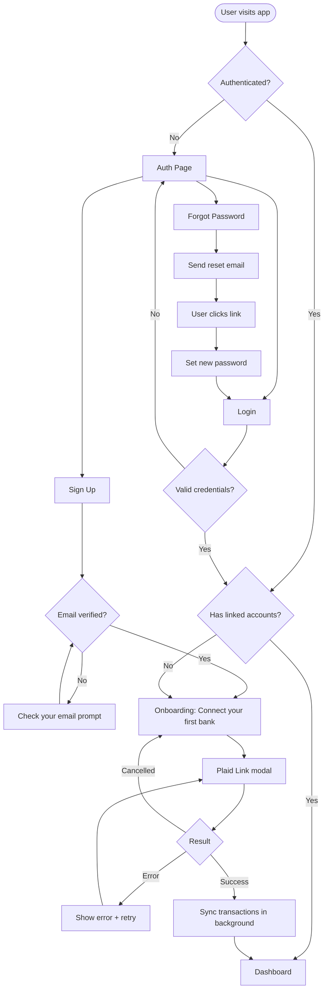
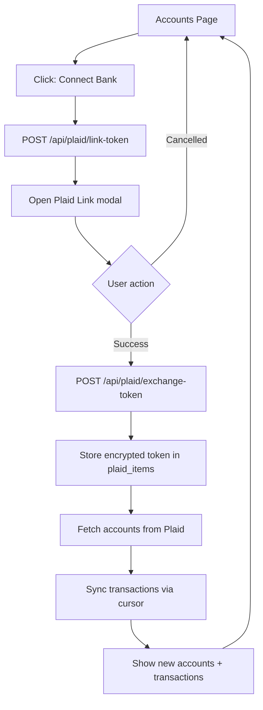
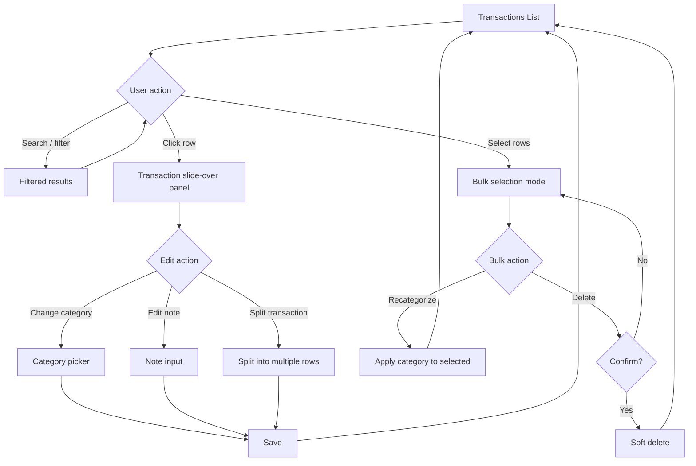
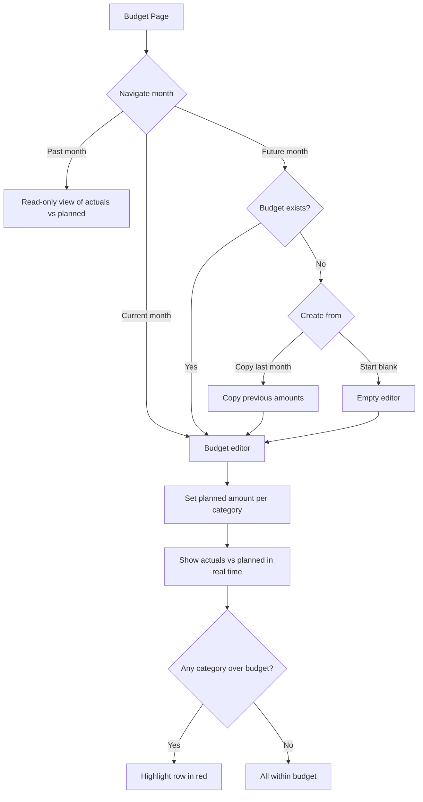
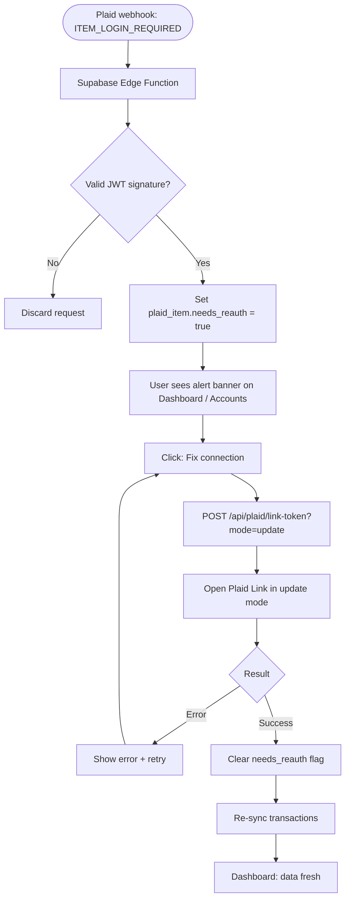
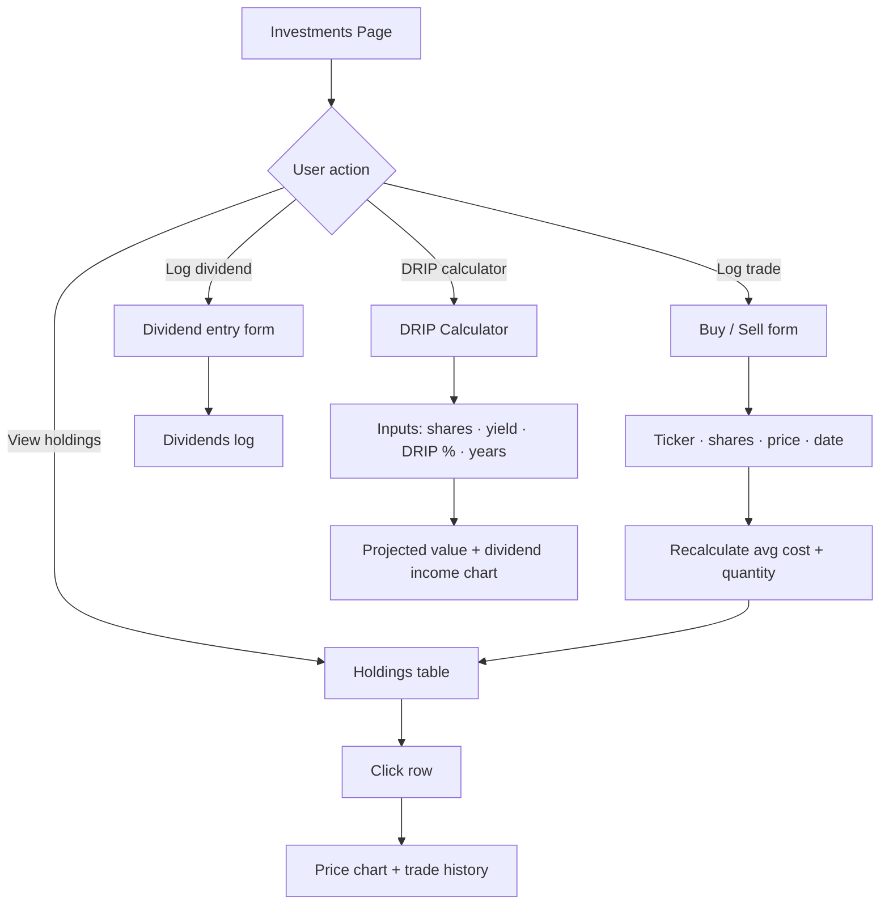
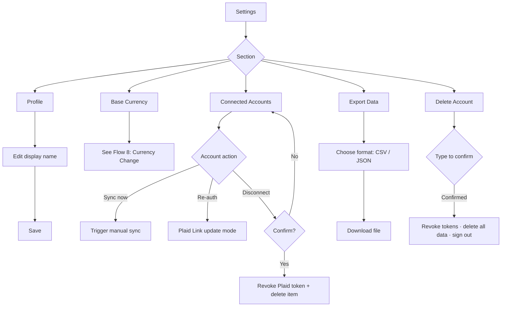
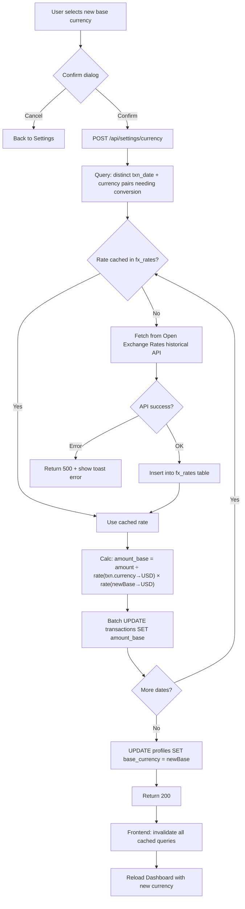

# Frontend User Flows

## 1. Onboarding & Auth

---

## 2. Bank Connection

---

## 3. Transaction Management

---

## 4. Budget Management

---

## 5. Plaid Re-auth (Item Error Handling)

---

## 6. Investments

---

## 7. Settings

---

## 8. Currency Change

> Triggered from Settings → Base Currency.
>
> **Key constraint:** Open Exchange Rates free tier only returns rates relative to USD.
> To convert between two non-USD currencies: `rate_A_to_B = rate_USD_to_B / rate_USD_to_A`.
> Historical rates are cached in the `fx_rates` table to avoid redundant API calls.

